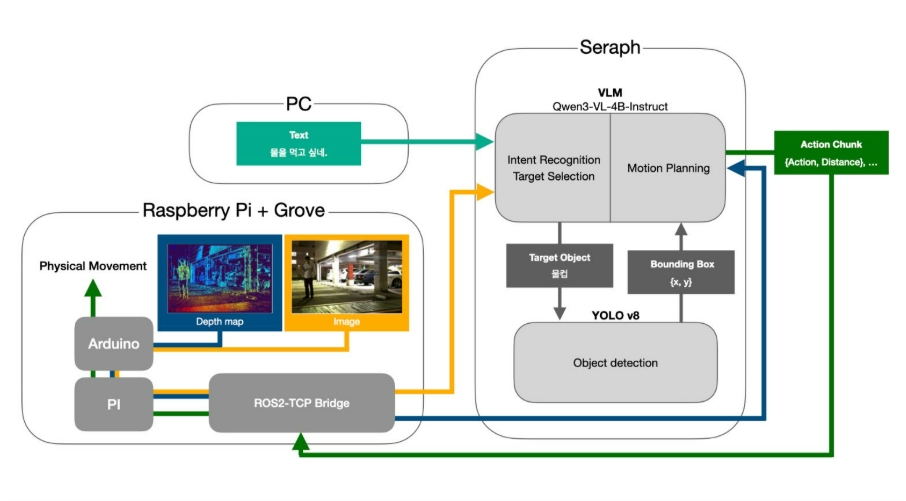

# VLM-Based Language-Guided Object Seeking Robot

> VLM을 활용해 자연어 명령의 맥락을 해석하고 목표 물체를 탐색·접근하는 ROS2 기반 로봇 시스템

사용자의 직접 명령(예: "컵 가져와")뿐 아니라 맥락형 명령(예: "목이 마르다")까지 해석하여 상황에 맞는 물체를 스스로 판단하고 접근하는 지능형 객체 탐색 로봇입니다. Vision-Language Model(VLM)을 상위 의사결정 모듈로, 임베디드 시스템을 저수준 제어 모듈로 분리한 dual-system 구조로 설계되었습니다.

📺 **데모 영상**: [YouTube 링크 또는 영상 GIF 삽입 예정]

---

## 📋 Table of Contents

- [Overview](#overview)
- [System Architecture](#system-architecture)
- [Key Features](#key-features)
- [Tech Stack](#tech-stack)
- [Installation](#installation)
- [Usage](#usage)
- [Project Structure](#project-structure)
- [Results & Performance](#results--performance)
- [Future Work](#future-work)
- [References](#references)

---

## Overview

기존의 객체 탐지 기반 로봇 시스템은 "빨간 컵을 가져와"와 같이 **목표가 명시된 명령**에는 잘 작동하지만, "목이 마르다"와 같이 **사용자의 의도나 상황적 맥락을 해석해야 하는 명령**에는 유연하게 대응하지 못합니다.

본 프로젝트는 Vision-Language Model을 활용해 다음을 해결합니다.

- **명령의 맥락 해석**: 직접 명령과 간접 명령 모두 처리
- **시각-공간 정보의 통합**: RGB-D 센서로 객체 위치와 거리를 함께 추론
- **의사결정과 제어의 분리**: 상위 추론(System 2)과 저수준 제어(System 1)를 모듈화

이를 통해 자연어 이해부터 실제 로봇 제어까지를 통합한 **VLM 기반 perception-decision 파이프라인**을 구현합니다.

---

## System Architecture



본 시스템은 크게 세 가지 모듈로 구성됩니다.

- **Raspberry Pi + Grove**: RGB 이미지와 Depth Map을 수집하고 ROS2-TCP Bridge를 통해 Seraph 서버로 전달합니다. Arduino와 시리얼 통신으로 저수준 모터 제어 명령을 전달하는 역할도 담당합니다.
- **Seraph (GPU 서버)**: 상위 의사결정을 수행하는 핵심 추론 모듈입니다. YOLOv8이 객체를 탐지하면, Qwen3.5-4B VLM이 사용자 명령과 시각 정보를 종합해 의도 인식(Intent Recognition), 목표 객체 선정(Target Selection), 그리고 행동 계획(Motion Planning)을 수행합니다.
- **Action Chunk**: VLM이 생성한 행동 결정을 `{Action, Distance, ...}` 형태의 구조화된 명령으로 변환해 ROS2-TCP Bridge를 통해 Arduino로 전달합니다.

### Data Flow

1. **명령 입력** — PC에서 사용자 자연어 명령 수신 (예: "물을 먹고 싶네")
2. **센서 데이터 수집** — Raspberry Pi가 RGB 이미지와 Depth Map 획득
3. **데이터 전송** — ROS2-TCP Bridge로 Seraph 서버에 전달
4. **객체 인식** — YOLOv8이 가정환경 물체 탐지 (bounding box, class)
5. **상위 추론** — Qwen3-VL이 명령·시각·공간 정보를 종합해 행동 결정
6. **Action Chunk 생성** — `{Action, Distance, ...}` JSON 형식으로 구조화
7. **저수준 제어** — Arduino가 모터 제어를 통해 물리적 이동 수행


---

## Key Features

- **맥락형 자연어 명령 처리** — 직접 명령("컵 가져와")과 간접 명령("목이 마르다") 모두 지원
- **VLM 기반 의사결정 파이프라인** — Qwen3.5를 상위 추론 모듈로 활용해 명령 해석부터 행동 계획까지 통합 처리
- **Vision-Depth 융합 객체 인식** — RGB 이미지의 의미 정보와 Depth Map 기반 거리·위치 정보를 결합
- **구조화된 Action Interface** — JSON 기반 action chunk로 상위 추론과 저수준 제어 간 인터페이스 표준화
- **분산 처리 구조** — Raspberry Pi(센서·통신), GPU 서버(추론), Arduino(저수준 제어)의 역할 분리
- **Prompt Engineering 기반 행동 제어** — Action space restriction, output formatting을 통한 안정적 명령 생성

---

## Tech Stack

| 영역 | 사용 기술 |
|------|----------|
| **언어** | Python, Arduino C |
| **로봇 프레임워크** | ROS 2 Humble |
| **객체 탐지** | YOLOv8 |
| **Vision-Language Model** | Qwen3.5-4B |
| **하드웨어** | Raspberry Pi 4 Model B (8GB), Arduino Uno, RGB-D Camera |
| **운영체제** | Ubuntu 22.04 LTS |
| **통신** | ROS2-TCP Bridge, Serial (Pi ↔ Arduino) |

---

## Installation

### Prerequisites

- Ubuntu 22.04 LTS
- Python 3.10+
- ROS 2 Humble
- CUDA 11.8+ (GPU 서버)
- Raspberry Pi OS (64-bit)
- Arduino IDE 2.0+
- 그냥 예시니까 차차 수정띠

### 1. Clone Repository

```bash
git clone https://github.com/ch0628/capstone_design.git
cd capstone
```

### 2. GPU Server Setup

#### Conda 환경 생성

먼저 conda 환경을 생성하고 활성화합니다.

​```bash
conda env create -f environment.yml
conda activate vla_v2
​```

이후 필요한 패키지를 별도로 설치합니다.

​```bash
pip install torch==2.5.1+cu121 torchvision==0.20.1+cu121 torchaudio==2.5.1+cu121 \
    --index-url https://download.pytorch.org/whl/cu121

pip install "transformers[serving] @ git+https://github.com/huggingface/transformers.git@main"
​```

> **Note**: `transformers`를 main 브랜치에서 설치하는 이유는 Qwen3.5 모델이 안정 버전(release)에 아직 포함되지 않았기 때문입니다.

#### Hugging Face Token 설정

본 프로젝트는 Hugging Face에서 Qwen3.5 모델을 다운로드하기 위해 사용자 토큰이 필요할 수 있습니다.

1. [Hugging Face Settings → Access Tokens](https://huggingface.co/settings/tokens)에서 Access Token을 발급합니다.
2. 프로젝트 루트 디렉토리에 `.env` 파일을 생성합니다.
3. 아래와 같이 토큰을 입력합니다.

​```bash
# .env
HF_TOKEN=your_huggingface_token_here
​```

> ⚠️ **Security**: `.env` 파일은 절대 Git에 커밋하지 마세요. `.gitignore`에 `.env`가 포함되어 있는지 확인하시기 바랍니다.

### 3. ROS 2 Workspace Build

```bash
cd ros2_ws
source /opt/ros/humble/setup.bash
colcon build --symlink-install
source install/setup.bash
# 예시니까 수정띠
```

### 4. Raspberry Pi Setup

```bash
# Pi에서 ROS 2 Humble 설치 후
cd ros2_ws
colcon build --packages-select sensor_node
source install/setup.bash
#예시니까 수정띠
```

### 5. Arduino Setup

`arduino/motor_control/motor_control.ino`를 Arduino IDE로 열고 보드에 업로드합니다.
예시니까 수정띠

### 6. 환경 설정

GPU 서버 IP, 시리얼 포트 등 환경 의존적인 설정값은 [실제 위치]에서 본인 환경에 맞게 수정하세요.

---

## Usage

### 1. GPU 서버 실행 (추론 서버)

```bash
# YOLOv8 + Qwen3-VL 추론 서버 시작
python server/inference_server.py --config config/server.yaml
```

### 2. Raspberry Pi 노드 실행

```bash
# 카메라 노드 + ROS2 브릿지
ros2 launch sensor_node sensor_bridge.launch.py
```

### 3. 명령 입력 (PC)

```bash
python client/command_client.py
> 명령 입력: 목이 마르다
```

### 실행 예시

```
[INFO] 명령 수신: "목이 마르다"
[INFO] YOLO 탐지 객체: [cup(0.92), bottle(0.88), tissue(0.85)]
[INFO] 공간 정보: cup @ (1.2m, 30°), bottle @ (2.1m, -15°)
[INFO] VLM 결정: target=cup, action=approach, distance=1.0m
[INFO] Arduino 명령 전송: forward 1.0m
[INFO] 작업 완료 (응답 시간: 2.4s)
```

---

## Project Structure

```
vlm-object-seeking-robot/
├── server/                    # GPU 서버 - 추론 모듈
│   ├── perception/            # YOLOv8 객체 탐지
│   ├── spatial_reasoning/     # RGB-D 기반 공간 정보 산출
│   ├── vlm_decision/          # Qwen3-VL 의사결정
│   └── prompts/               # VLM 프롬프트 템플릿
├── ros2_ws/                   # ROS2 워크스페이스
│   └── src/
│       ├── sensor_node/       # Pi 센서 데이터 수집·전송
│       ├── tcp_bridge/        # ROS2-TCP 통신 브릿지
│       └── action_dispatcher/ # Action chunk → Arduino 변환
├── arduino/                   # Arduino 저수준 제어
│   └── motor_control/
├── client/                    # 사용자 명령 클라이언트
├── dataset/                   # 학습 데이터셋 (미포함, README 별도 안내)
├── weights/                   # 모델 가중치
├── config/                    # 환경 설정 파일
├── docs/                      # 추가 문서·다이어그램
└── tests/                     # 테스트 스크립트
# 우리가 나중에 수정하기
```

---

## Results & Performance

> 실험은 진행 중이며, 결과는 지속적으로 업데이트됩니다.

### 1. 객체 인식 성능 (YOLOv8)

| 항목 | 파인튜닝 전 | 파인튜닝 후 |
|------|------------|------------|
| mAP@0.5 | TBD | TBD |
| mAP@0.5:0.95 | TBD | TBD |
| 추론 속도 (FPS) | TBD | TBD |

**클래스별 성능 (파인튜닝 후)**

| Class | Precision | Recall |
|-------|-----------|--------|
| cup | TBD | TBD |
| bottle | TBD | TBD |
| remote | TBD | TBD |
| tissue | TBD | TBD |
| bag | TBD | TBD |

### 2. 공간 정보 정확도 (RGB-D)

| 항목 | 측정값 |
|------|--------|
| 평균 거리 추정 오차 | TBD cm |
| 상대좌표 각도 오차 | TBD ° |

### 3. VLM 의사결정 성능

| 항목 | 측정값 | 목표 |
|------|--------|------|
| 직접 명령형 TSR (Task Success Rate) | TBD % | ≥ 90% |
| 맥락형 TSR | TBD % | ≥ 70% |
| Semantic Mapping 성공률 | TBD % | ≥ 80% |
| 부적절한 행동 명령 발생률 | TBD % | ≤ 5% |

### 4. 시스템 응답 시간 (End-to-end Latency)

| 항목 | 평균 | p95 | 목표 |
|------|------|-----|------|
| 전체 응답 시간 | TBD s | TBD s | ≤ 3.0s |
| 이미지 전송 (Pi → Server) | TBD ms | TBD ms | - |
| YOLOv8 추론 | TBD ms | TBD ms | - |
| VLM 추론 | TBD ms | TBD ms | - |
| Action 생성 | TBD ms | TBD ms | - |

### 5. 실제 주행 성공률

| 시나리오 | 성공률 (10회 시도) | 평균 도달 시간 |
|---------|-------------------|---------------|
| 직접 명령형 - 단일 객체 | TBD / 10 | TBD s |
| 직접 명령형 - 다중 객체 | TBD / 10 | TBD s |
| 맥락형 - 단일 후보 | TBD / 10 | TBD s |
| 맥락형 - 다중 후보 | TBD / 10 | TBD s |

### 6. 실패 케이스 분석

실험 후 실패 케이스를 카테고리별로 분류하여 추가 예정.

---

## Future Work

- **End-to-end VLA 모델로의 확장** — 현재 modular 접근을 baseline으로, OpenVLA 등 학습 기반 접근과 성능 비교
- **음성 명령 인터페이스 통합** — Whisper 등 STT 결합
- **자율주행 기능 추가** — Nav2 통합으로 더 넓은 환경에서 동작
- **물체 집기(grasping) 기능** — 매니퓰레이터 추가 시 manipulation까지 확장
- **다양한 환경에서의 일반화 평가** — 가정환경 외 사무실·공공장소 등

---

## References

<!-- 인용한 논문, 모델, 라이브러리 등을 추가 -->

---

## Academic Submission

본 프로젝트는 **2026 한국정보과학회 학술대회(KSC) 학부생 논문 부문** 투고를 목표로 하고 있습니다.

---

## License

This project is for academic and research purposes.

---

## Contact

프로젝트 관련 문의는 GitHub Issues를 통해 부탁드립니다.
